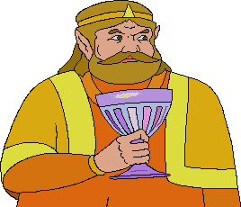

# 👑 King Harkinian Desktop Pet

> *"Mah boi, this desktop pet is what all true Linux users strive for!"*

---



---

A gloriously low-effort GTK desktop pet that plops the King himself right onto your Linux desktop. He roams around, squishes, spins, bounces, shakes, and randomly yells his iconic CD-i voice lines at you when you least expect it. Just like real royalty. 👑
You also have to feed him with the food dispensed from the iconic Dinner Machine! Bro, if you haven't watched the iconic <a href="https://www.youtube.com/watch?v=5k6lu1ynsBk" target="_blank">"The King gets a Dinner Machine"</a> by Nin10Guy, then go fucking watch it, you uncultured swine!

---

## 🔽 DOWNLOAD

[Download King Harkinian Desktop Pet (ZIP)](https://github.com/That1DutchGuy1/King-Harkinian-Desktop-Pet/archive/refs/heads/main.zip)

---

## 🚨 REQUIREMENTS

Before you dare run this, make sure you have the necessary garbage installed:

```bash
sudo apt install python3-gi gir1.2-gtk-3.0 gir1.2-gdkpixbuf-2.0 gir1.2-appindicator3-0.1
```

**Optional (but strongly recommended for better audio):**

```bash
pip install pygame
```

If you don't have `pygame`, the script falls back to `aplay` which ships with `alsa-utils` and is probably already on your machine. If you have neither, the King will roam your desktop in absolute silence like a cursed ghost. Your choice. 🤷🏻‍♂️

---

## 📁 FILE STRUCTURE

All of these need to be sitting in the **same directory** together, or the King won't show up and you'll have only yourself to blame motherfucker:

```
king_harkinian_pet.py
King-Harkinian-CD-i.png
fist.png
Dinner.mp3
Mah-Boi.mp3
King-Harkinian-Laugh.mp3
This-Peace-Is-What-All-True-Warriors-Strive-For.mp3
scrub-all-the-floors-in-hyrule.mp3
duke-onkled-under-attack.mp3
enough.mp3
im-going-to-gamelon.mp3
hmm.mp3
piece-of-shit.mp3
triforce-of-courage.mp3
ship-sails.mp3
wonder-whats-for-dinner.mp3
you-saved-me.mp3
king-oah.mp3
king-hoa.mp3
eating.mp3
burp.mp3
hit.mp3
dinner-machine.png
pizza.png
panini.png
happy-meal.png
chicken-bucket.png
cheese.png
fish-and-chips.png
steak.png
strawberry-cake.png
salmong.png
hot-dog.png
```

The food images, dinner machine, and fist are optional — if they're not there, those features simply won't appear. The King will still roam your desktop like a normal unstable monarch.

The script will silently skip any MP3s it can't find, so you won't get an error if you're missing some. You'll just get a less unhinged experience, which is your loss honestly.

---

## 🎮️ HOW TO RUN

Open the **king-pet** folder, aka the main directory, in your terminal.
Then copy-paste this command and execute it:

```bash
python3 king_harkinian_pet.py
```

That's it. The King appears. You're welcome, bitch.

---

## 🕹️ CONTROLS

| Action | What it does |
|---|---|
| **Left-click** the King | Forces him to speak immediately. Rude, but effective. |
| **Right-click** the King | Kills him. He'll have something to say about it. |
| **Tray icon** (right-click) | Toggle visibility, make him speak, or quit |
| **Left-click** the Dinner Machine | Picks a random food and sticks it to your cursor. You are now responsible for feeding the King. |
| **Left-click** to place food | Drops the food on the desktop. The King will handle the rest. He always handles dinner. |
| **Rapidly rub** the King | Tickles him. He will scream. Repeatedly. You monster. |
| **HIT MODE button** (bottom-left) | Replaces your cursor with a fist. You know what it's for. |
| **Swipe the fist** across the King | Sends him flying with actual physics. You asked for this. |

---

## 👑 ANIMATIONS

The King is a man of many talents! Here's what he gets up to:

* **Walk** — A dignified stroll across your desktop, facing whichever way he's actually going like a normal person
* **Bounce** — Squishes on impact like the royalty he is
* **Spin** — Absolutely unhinged 360° rotation
* **Squish** — Chaotic stretching in all directions
* **Shake** — Full-body trembling, probably excited about dinner
* **Zoom** — Grows and shrinks like he's having a moment
* **Tilt** — Slow, seasick rocking back and forth. He's on a ship. His ship sails in the morning. You know this.
* **Stomp** — Rapid vertical pounding like he found out Link failed to save Zelda *again*
* **Panic** — Frantic zigzag sprinting at double speed. Something has gone very wrong in Hyrule.
* **Nod** — Enthusiastic squash-and-stretch bobbing. He agrees with whatever you're doing. He doesn't, but he's being polite.
* **Moonwalk** — Slides backwards while facing forwards. The King has swag. Undeniable, inexplicable swag.
* **Vibrate** — Extremely fast tiny jitter, like he touched an electric fence or read the royal tax return
* **Warp** — Bad VHS tape energy. Corrupted video signal. Probably from a scratched CD-i disc, shocking.
* **Chalice** — Looms directly at you, growing larger, personally shoving the chalice in your face. You cannot escape the chalice.
* **Flatline** — Pancakes completely flat to the floor and creeps around like a condemned royal trying to escape under a door. Haunting.
* **Dizzy** — Figure-8 wobble like he got smacked with a frying pan. He has been smacked with a frying pan.
* **Creep** — Freezes completely still for a couple seconds, then SNAPS to a new location with no warning whatsoever. Low-budget horror movie. Do not look away.
* **Glitch** — Corrupted CD-i disc. Random scale and angle snaps with no interpolation. He is broken. We are all a little broken.
* **Royal Wave** — Shoots up tall and regal, then sways side to side like he's personally blessing the entire crowd. Barely moves because he's too busy being majestic. He is very busy. Do not disturb.
* **Teleport** — Squashes completely flat, vanishes, then POPS back into existence somewhere completely different on your screen with a springy overshoot. No physics justification. No explanation. King does what King wants.
* **Stretch** — Becomes an uncomfortably tall noodle — 2.6× his normal height and paper thin — ripples like a wet sock in the wind, then SNAPS back to normal with a rebound. Deeply unsettling. Deeply correct.
* **Helicopter** — Full 360° spin while drifting sideways at speed. He has ascended. He is airborne. He is done with the ground. This is his life now and he seems fine with it.
* **Hiccup** — Gentle idle sway interrupted by random sharp jolts at irregular intervals, like he had too much of whatever's in that chalice. Honestly, fair enough. Nobody blame him.
* **Microwave** — Slow, dignified rotation while gently pulsing in and out in size. DINNER. IS. BEING. PREPARED. Do not open the door until the beeping stops. 📡

He switches between these randomly. Twenty-four possible states of unhinged royalty. Watch him become a gaaaawd!

---

## 🎙️ VOICE LINES

Every ~5 seconds, there's a **55% chance** the King decides to open his mouth. The available clips are:

* *"Dinner!"* — he's hungry!
* *"Mah boi!"* — you're his boi now, motherfucker.
* *"OAHAHAHAHAHAHAHAAA!!"* — he's probably laughing at you.
* *"This peace is what all true warriors strive for!"* — he thinks that... but Link doesn't.
* *"Scrub all the floors in Hyrule!"* — used to be Duke Onkled's punishment. Now it's yours.
* *"Duke Onkled is under attack by the evil forces!"* — urgent news delivery, zero context provided
* *"Enough!"* — he's had it. With what? Everything. All of it.
* *"I'm going to Gamelon!"* — he is going. He has decided. There is nothing you can do.
* *"Hmm."* — profound. Weighty. He is thinking about dinner.
* *"Piece of shit!"* — yeah, he's talking about you, dickhead.
* *"The Triforce of Courage!"* — he says this with the energy of a man who has never held the Triforce of Courage
* *"My ship sails in the morning!"* — it does. It always does. He says this at 3pm.
* *"I wonder what's for dinner?"* — an eternal question. A philosophical inquiry. He already knows. It's dinner.
* *"You saved me!"* — said with genuine surprise, as if he didn't hire you specifically for this.
* *"OAH!"* — he is feeling very indignant, angry, or something else because of whatever you did.
* *"HOA!* — the excited version of OAH. Only food makes him this excited.

Voice lines will not overlap. The King has dignity. Barely, but still. The script only loads clips that are actually present on disk, so it won't crash just because you forgot to download `piece-of-shit.mp3`. Good for you.

And when you try to kill him? He gets the last word. `king-oah.mp3` plays in full before the program exits, whether you right-click him, use the tray menu, or hit `Ctrl+C` in the terminal. You can't silence royalty. 👑

---

## 🍕 THE DINNER MACHINE

The King is hungry. He is always hungry. That is his entire personality and you will respect it.

In the bottom-right corner of your screen, you'll find the **Dinner Machine** — a mysterious appliance of unknown origin that dispenses food directly onto your desktop. Left-click it and a random meal will attach itself to your cursor like a cursed gift. You are now the delivery guy. Congratulations on your new job.

**Left-click anywhere on the desktop** to drop the food. Don't place it on top of the King — he's not ready yet and he will simply refuse, because royalty has standards about plating.

Once the food is placed, the following chain of events will occur whether you want them to or not:

1. **The King notices.** He plays a sound clip. He is very pleased.
2. **He spins on the spot** to face the food — a full 360° rotation of pure regal anticipation.
3. **He runs toward it** at approximately the speed of a man who has been told it's dinnertime. He wobbles. He stomps. He leans. It's undignified and perfect.
4. **He eats it.** Chomping squish animation, food wobbling in protest, full eating sound effects. The meal doesn't stand a chance.
5. **He burps.** Loudly. With his whole body. The King shudders with satisfaction.
6. **He gets fatter** with every piece of food you feed him.
7. **He resumes his normal behaviour**, presumably thinking about his next meal.

The food choices are:

1. **Pizza**
2. **Panini**
3. **Happy Meal**
4. **Chicken bucket**
5. **Cheesecake**
6. **Ice cream cone**
7. **Taco**
8. **Burger**
9. **Spaghetti**
10. **Fish & Chips**
11. **Steak**
12. **Strawberry cake**
13. **Grilled salmon**
14. **Hot dog**

Want to add your own? Drop any 512×512 PNG into the script folder, add the filename to the `FOOD_IMAGES` list in `king_harkinian_pet.py`, assign a fat point value, and the King will devour it without complaint. He is not picky. He never was. He wonders what's for dinner and the answer is: whatever you give him.

**The King always faces the food correctly.** If the food is to his left, he mirrors to face left. If it's to his right, he faces right. He has spatial awareness. More than you, probably. 👑

The Dinner Machine disappears when Hit Mode is active, because you can't punch a king AND feed him at the same time. Choose your priorities.

---

## 😂 TICKLING

The King is ticklish. Of course he's ticklish. He's a soft man who wonders what's for dinner. You found the one thing he cannot handle with dignity, and now you're going to use it against him, you absolute menace.

**Rapidly rub your cursor back and forth across his sprite** — left, right, left, right, fast — and he will lose his composure entirely. The faster and more sustained the rubbing, the more unhinged he becomes. He screams. He squirms. His whole body writhes in alternating lean-squish-jitter that gets wilder the longer you keep going.

The tickle scream (`king-oah.mp3`) fires immediately the moment he breaks, then keeps spamming every ~18 frames for as long as you keep rubbing him. If he was mid-sentence when you started — mid voice-line, talking about dinner or peace or warriors — **it gets cut off immediately.** The tickle takes priority. As it should. Royalty or not, nobody can hold a speech while being tickled.

Stop rubbing and he'll collect himself with a damped dignity-restoration wobble before going back to his normal business. He will pretend this never happened. It did happen. You both know it.

---

## 👊 HIT MODE

You've fed the King. You've tickled the King. You've listened to him yell about dinner fourteen times. At some point, you start to wonder: what if I just... hit him?

Good news. There's a button for that.

The **red HIT MODE button** lives in the **bottom-left corner** of your screen. Click it. Your cursor disappears and is replaced by a **fist** that always points directly at the King no matter where you move it. He knows it's coming. He cannot escape.

**Swipe the fist across the King** — fast — and you'll launch him across the screen with actual physics. He goes airborne. He spins. He bounces off the floor and walls, losing energy each time, squishing flat on impact and snapping back. He careens around your desktop like a royal pinball until gravity finally defeats him and he skids to a stop. Then he stands up, absolutely seething, and yells *"Piece of shit!"* at you. At you. The person who just did that to him.

A few notes on the physics, because this was clearly thought about:

- **The harder you swipe, the faster he flies.** Speed is mapped to launch velocity. Gentle flick = gentle tumble. Full-speed drag across the screen = he becomes a projectile.
- **You can hit him while he's already airborne.** Each additional swipe adds to his existing velocity, so rapid combos fling him harder and harder until he's absolutely bouncing off everything.
- **He can also be hit mid-sulk**, during the recovery animation. He was in the middle of being furious and you interrupted him with more violence. Incredible. He's airborne again immediately, you fucking lunatic.
- **The fist rotates to always aim at him** — it points in his direction no matter where you position it, like a weapon with opinions.
- **Click-through fist** — the fist window is transparent to clicks everywhere except motion tracking, so you can still hit the Stop button to turn off Hit Mode without fighting through an invisible overlay like an idiot.
- **The fist hides itself** when you hover over the Stop button so you can actually click it. Thoughtful. Considerate. Violence with UX polish.
- **Hit sounds play with a cooldown** so rapid swipes don't stack into an audio catastrophe. A few overlapping `hit.mp3` clips are fine. An infinite pile of them is not. The script knows this. The script has limits. You don't, apparently.

When you're done assaulting the King and click **STOP HIT**, he snaps back to normal roaming immediately, dignity somehow still technically intact. The Dinner Machine reappears. You can feed him again if you feel like making up for what you just did.

---

## 🚀 AUTOSTART (Optional)

Want the King to bless your desktop every single time you log in? Of course you do.

1. Edit `king-harkinian-autostart.desktop` and replace `YOUR_USERNAME` with your actual username:

```ini
Exec=python3 /home/YOUR_USERNAME/king_harkinian_pet.py
Icon=/home/YOUR_USERNAME/Documents/King-Harkinian-Desktop-Pet/king-pet/King-Harkinian-CD-i.png
```

2. Drop it in your autostart folder:

```bash
cp king-harkinian-autostart.desktop ~/.config/autostart/
```

The King will now report for duty every login. You asked for this, idiot. 👍🏻

---

## 🖥️ ADD A DESKTOP SHORTCUT (Optional)

If you want to launch the King from your application menu or desktop:

```bash
cp king-harkinian-pet.desktop ~/Desktop/
chmod +x ~/Desktop/king-harkinian-pet.desktop
```

Update the `Exec` path inside the file to match wherever you actually put the script.
Update the `Icon` path inside the file to wherever you left the King so that you can have a proper lil icon for his shortcut.
I use the Documents folder myself, but you can change it to wherever the hell you want it to be.

---

## ☢️ FUN TIP

In Linux Mint 22 Cinnamon, you can add the (`king-harkinian-pet.desktop`) file to (`.local/share/applications/`) to add it to your applications menu and pin it to your panel! \
If you attached the icon file correctly, then the King will show up inside your panel too, always judging you from there.

---

## 🐛 FIXES & CHANGES

### What's new in this update, you impatient person:

**Hit counter** — The script now tracks your score for keeping the King in the air by consecutive hits to him! Kinda mean, but fun for sure. Just not for him.

**More food** — Added fish & chips, cheese, steak, and a big ass strawberry cake! It's Dinner Mania here now!

**New food eating animation** — The King now eats a lot messier, with food particles coming from the food when he eats! Damn, what a filthy pig.

**New animations** — The King now has six new animations! Royal Wave, Teleport, Stretch, Helicopter, Hiccup, and Microwave! Watch him become a gawd!!

**Fat point system** — With every piece of food eaten from the Dinner Machine, he gets fatter, until eventually exploding! Don't worry, he will come back... eventually.

---

## 💬 Q & A

> **Q: Does this work on Windows or Mac?** \
> **A:** No. GTK desktop pets are a Linux thing. Get a real operating system. 😁

> **Q: Which distros is this compatible with?** \
> **A:** I dunno exactly. It works on my Linux Mint 22 Cinnamon machine. Go try it out and you'll see if the King hates you or not.

> **Q: Why are the animations looking so badly?** \
> **A:** Bruh, you never seen the CD-i Zelda cutscenes? They're intentionally like this, you fucking uncultured shit.

> **Q: The King isn't making any sounds!** \
> **A:** Install `pygame` or check if `aplay` is on your system. Also check that the MP3 files are in the same folder as the script. The King cannot speak if you don't give him his voice lines.

> **Q: Can I add my own voice lines?** \
> **A:** Yes! Drop any MP3 into the script folder and add the filename to the `VOICE_LINES` list in `king_harkinian_pet.py`. The King will add it to his repertoire immediately. 🎙️

> **Q: Why does he face left sometimes?** \
> **A:** Because he's walking left, genius. He mirrors automatically depending on which direction he's moving. The spin, shake, vibrate, stomp, moonwalk, flatline, creep, and glitch animations are exempt from mirroring because they either don't travel, look stupid flipped, or are already chaotic enough that nobody's checking. The King has standards. Variable standards, but standards.

> **Q: Why is he moonwalking in the wrong direction??** \
> **A:** He's not. That IS the moonwalk. He faces one way and slides the other. That's the whole bit. Michael Jackson invented it, the King borrowed it, and now it's on your desktop. You're welcome.

> **Q: He just froze completely still and it's been like 5 seconds, is he broken?** \
> **A:** That's the creep animation. He's about to snap to a new location with zero warning. Stop staring at him. That's what he wants.

> **Q: I get a bunch of pygame warnings in the terminal!** \ 
> **A:** You don't anymore. The script suppresses pygame's startup spam automatically. You're welcome.

> **Q: Why is there a vending machine on the bottom right of my screen?** \
> **A:** Bro, that's the Dinner Machine, you idiot! Yes, it nabbed a random vending machine PNG from Google Images. So fucking what?

> **Q: I tickled him while he was talking and he just stopped mid-sentence.** \
> **A:** Yes. That's intentional. That's the bit. He was talking about dinner, probably. You decided to rub him. He cannot do both. The tickle wins. The tickle always wins.

> **Q: The fist is invisible!** \
> **A:** Oh, then you're either a complete dumbass and forgot to put it in place, or you're hovering over the fucking button, idiot.

> **Q: I punched him while he was already flying and he went way faster.** \
> **A:** Yes. That's how momentum works. That's how the code works. Rapid combos stack. You can fling him so hard he's basically teleporting between walls. You could also just not do that. But here we are.

> **Q: Why is he getting bigger?** \
> **A:** That's because you keep feeding him, bozo!

> **Q: This is stupid.** \
> **A:** Correct. 🙃

---

## 🛠️ TESTED ON

* **Linux Mint 22 Cinnamon** — works perfectly, obviously
* Probably works on Ubuntu, Debian, and anything else GTK-friendly. I dunno, too lazy to test, now fuck off.

---

(Note: This download includes a free desktop background made by super fabulous yours truly, That One Dutch Guy!)

---

> *"Enough! My ship sails in the morning!"* 👑🍷